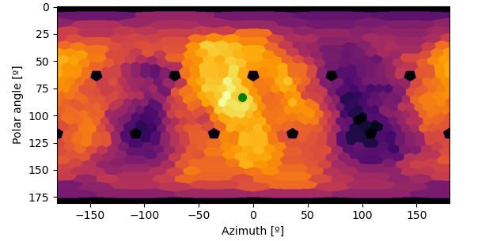
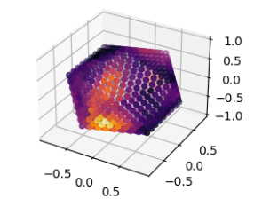

## `icoCNN.plots`

Plotting functions for icosahedral signals.

 - [`icosahedral_charts`](#icosahedral_charts)
 - [`SphProjector`](#SphProjector)
 - [`icosahedral_scatter`](#icosahedral_scatter)
 - [`draw_icosahedron`](#draw_icosahedron)
 
### `icosahedral_charts`
Plot the 5 charts of an icosahedral signal as a 5*2^r x 2^(r+1) image.
	The image is hard to interpret visually, but it's the projection used to perform the convolutions.
#### Parameters
* **x** : *torch tensor or numpy ndarray with shape [5, 2^r, 2^(r+1)] or [5, 2^r+2, 2^(r+1)+2] (padded signals)*,
        Icosahedral signal to plot
* **ax** : *matplotlib axes, optional*,
        Axes to plot the signal in. It can be useful to make subplots.
        If it is not provided, a new matplotlib figure is created.
* **cmap** : *matplotlib cmap (optional)*,
        Colormap to use in the plot. Default is 'inferno'.
* **colorbar** : *bool (optional)*,
        Include a colorbar into the plot, default is False.

   

### `SphProjector`
Class to plot icosahedral signals as spherical equiangular projections.
	This 2D figure easier to interpret, but preparing the projection is a bit slow.
	After having created the object, you can use its plot_projection method to plot signals.
#### Parameters
* **r** : *int*,
        Resolution of the icosahedral signals that will be projected
* **res_theta** : *int (optional)*,
        Number of elevation points of the projections. Default is 512
* **res_phi** : *int (optional*,)
        Number of azimuth points of the projections. Default is 1024
#### `get_projection`
Compute the projection of an icosahedral signal
##### Parameters
* **x** : *torch tensor or numpy ndarray with shape [5, 2^r, 2^(r+1)]*,
            Icosahedral signal to plot
##### Returns
*Numpy ndarray with shape res_theta x res_phi+1*,
			The last column of the matrix will be equal to the first one since both represent phi = -pi = +pi.
#### `plot_projection`
Plot the projection of an icosahedral signal
##### Parameters
* **x** : *torch tensor or numpy ndarray with shape [5, 2^r, 2^(r+1)]*,
            Icosahedral signal to project
* **ax** : *matplotlib axes (optional)*,
            Axes to plot the signal in. It can be useful to make subplots.
            If it is not provided, a new matplotlib figure is created
* **cmap** : *matplotlib cmap (optional)*, 
            Colormap to use in the plot. Default is 'inferno'
* **colorbar** : *bool (optional)*,
            Include a colorbar into the plot, default is False

   

### `icosahedral_scatter`
Plot an icosahedral signal as a 3D scatter plot where each hexagonal pixel is a 3D point with the proper color.
	The visual result isn't very good, but it's easy to do, so it can be useful for some quick tests.
	`icoCNN.plots.draw_icosahedron` provides better 3D plots using `VPython`.
#### Parameters
* **x** : *torch tensor or numpy ndarray with shape [5, 2^r, 2^(r+1)]*,
        Icosahedral signal to plot
* **grid** : *4D ndarray with shape [5, 2^r, 2^(r+1), 3] (optional)*,
        3D Cartesian coordinates of every point of the icosahedral grid where x is defined.
        If it is not provided, it is computed inferring its resolution from the shape of x
* **ax** : *matplotlib axes (optional)*,
        Axes to plot the signal in. It should have projection='3d'.
        If it is not provided, a new matplotlib figure is created
* **cmap** : *matplotlib cmap (optional)*,
        Colormap to use in the plot. Default is 'inferno'

   

### `draw_icosahedron`
Draw an icosahedral signal in 3D using `VPython`.
	The vertices of each hexagonal pixel is computed according to their neighbors, so they aren't accurate at the edges.
	This effect is negligible when using icosahedral signals with resolution `r=3` but is visible for lower resolutions.
#### Parameters
* **x** : *torch tensor or numpy ndarray with shape [5, 2^r, 2^(r+1)]*,
        Icosahedral signal to draw
* **canvas** : *VPython canvas (optional)*,
        Canvas to draw the signal in.
        If it is not provided, the active one will be used (or a new one will be created)

   

